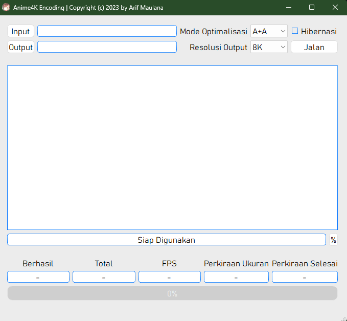

---

# Anime4KEncoding

  

    
    
    
    

## Deskripsi
Anime4KEncoding adalah sebuah aplikasi Python untuk meningkatkan resolusi video anime dan kemudian mengkodeknya kembali. Aplikasi ini memungkinkan pengguna untuk mengatur mode optimalisasi dan resolusi output.

**[Download Prebuild Windows Versi Terbaru](https://github.com/Arifmaulanaazis/Anime4KEncoding/releases)**

## Shader yang Digunakan
Aplikasi ini menggunakan shader dari **[Anime4K](https://github.com/bloc97/Anime4K)** yang dikembangkan oleh **block97**. Anime4K adalah teknik upscaling yang dirancang khusus untuk anime, yang memanfaatkan shader untuk meningkatkan detail visual dan kejelasan tanpa mengorbankan performa. Shader dari Anime4K memberikan kualitas tinggi dalam proses upscaling dengan tetap mempertahankan estetika asli dari konten anime.

## Fitur Utama
- Upscaling video anime.
- Mendukung pengkodean ulang video dengan mode dan resolusi yang dapat disesuaikan.
- Mendukung pengkodean multiple file video atau single file.
- Memungkinkan pengguna untuk memilih mode optimalisasi dan resolusi output.

## Cara Menggunakan
1. Pastikan Anda memiliki Python dan dependensi yang diperlukan yang tercantum di file `requirements.txt`.
2. Clone repositori ini ke komputer Anda.
3. Buka terminal atau command prompt, lalu navigasikan ke direktori tempat Anda menyimpan repositori.
4. Install dependensi dengan menjalankan `pip install -r requirements.txt`.
5. Jalankan aplikasi dengan menjalankan `python main.py`.
6. Pilih file video yang ingin Anda tingkatkan resolusinya dengan mengklik tombol "Input" dan pilih folder untuk menyimpan video yang ditingkatkan dengan mengklik tombol "Output".
7. Pilih mode optimalisasi dan resolusi output yang diinginkan dari menu dropdown.
8. Klik tombol "Jalan" untuk memulai proses encoding.
9. Tunggu hingga proses selesai.

## Kontribusi
Anda dapat berkontribusi pada proyek ini dengan mengirimkan pull request melalui GitHub.

## Lisensi
Proyek ini dilisensikan di bawah lisensi Massachusetts Institute of Technology (MIT). Lihat [LICENSE](LICENSE) untuk informasi lebih lanjut.

---
